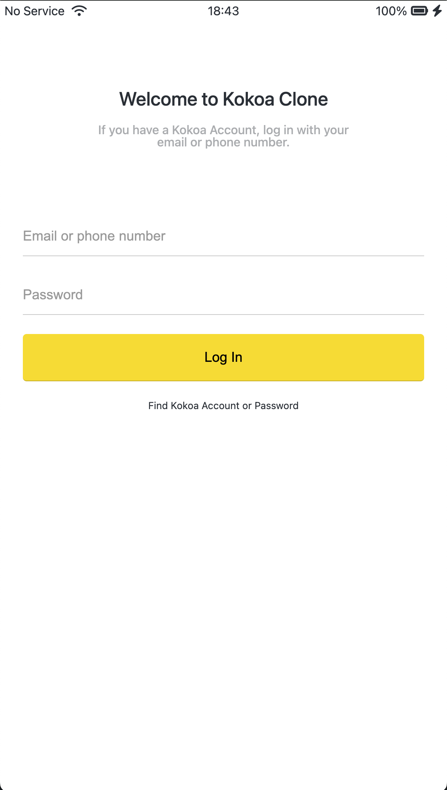
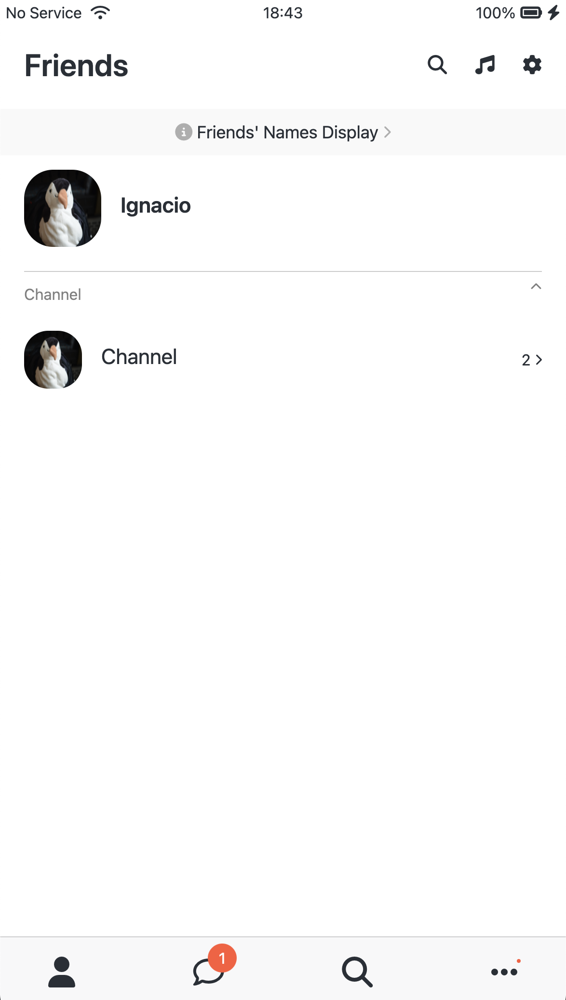

# Kokoa Clone 2024
</a>
</a>

 
 
 

[Go to the project](https://ignacioseo.github.io/kokoa-clone-2024/)

## About
This is a chat application view created using HTML and CSS.

## Motivation
While creating a mock server with Node JS, there was no undestanding about using HTML input tags to submit to server. For this reason, chat app clone screens were created with HTML and CSS. This project was based on online lectures.

## Methods
  * BEM(Block, Element, Modifier)
  * Componentisation of HTML and CSS

## Used

## References
https://nomadcoders.co  
https://developer.mozilla.org/en-US/